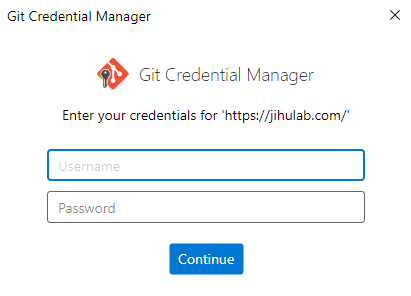

# 1. 从ESP-IDF安装管理器中安装idf-v6.0.1

## 1.1 安装过程中卡在第2步检查Python环境的最后一步检查SSL/HTTPS发生错误的解解决办法：


## 1.2 我用自定义安装，在选择镜像时选国内镜像。

## 1.3 选择仓库时我选github.com，因为后面需要输入帐号和密码，不要乱选仓库，比如当选了<https://jihulab.com/，后面需要输入帐号和密码。>

 ***。。。。。。。。。。。。没帐号！！！！！***

## 1.4 我同时选择了ESP-IDFV5.5.4和ESP-IDFV6.0.1进行安装

## 1.5 然后等待完成即可。
  注意：ESP-IDF 安装管理器会为每个版本创建一个IDF_vX.X.X_Powershell快捷方式，用于启动ESP-IDF开发环境。点击后，会打开ESP-IDF的PowerShell窗口，已经配置好了环境变量，可以直接执行idf.py命令。如下所示：
```
IDF PowerShell Environment
-------------------------
Environment variables set:
IDF_PATH: C:\esp\v6.0.1\esp-idf
IDF_TOOLS_PATH: C:\Espressif\tools
IDF_PYTHON_ENV_PATH: C:\Espressif\tools\python\v6.0.1\venv

Custom commands available:
idf.py - Use this to run IDF commands (e.g., idf.py build)
esptool.py
espefuse.py
espsecure.py
otatool.py
parttool.py

Python environment activated.
You can now use IDF commands and Python tools.
(venv) PS C:\Users\27928\Desktop>
```
## 1.6 idf-env.json文件
C:\Users\27928\.espressif\idf-env.json
```
{
    "idfInstalled": {
        "C:\\esp\\v6.0.1\\esp-idf-v6.0": {
            "version": "6.0",
            "path": "C:\\esp\\v6.0.1\\esp-idf",
            "features": [
                "core"
            ],
            "targets": [
                "esp32s3",等等
            ]
        },
        "C:\\esp\\v5.5.3\\esp-idf-v5.5": {
            "version": "5.5",
            "path": "C:\\esp\\v5.5.3\\esp-idf",
            "features": [
                "core"
            ],
            "targets": [
                "esp32s3",等等
            ]
        }
    }
}
```
## 1.7 .espressif\python_env目录
C:\Users\27928\.espressif\python_env
d----- idf5.5_py3.13_env
d----- idf6.0_py3.14_env
每个Python环境下有一个pyvenv.cfg文件，用于指定Python环境的路径，多Python环境、多ESP-IDF版本，很容易出现Python环境冲突。
```
home = C:\Users\27928\AppData\Local\Python\pythoncore-3.14-64
include-system-site-packages = false
version = 3.14.6
executable = C:\Users\27928\AppData\Local\Python\pythoncore-3.14-64\python.exe
command = C:\Users\27928\AppData\Local\Python\pythoncore-3.14-64\python.exe -m venv C:\Users\27928\.espressif\python_env\idf6.0_py3.14_env
```

# 2. mqtt组件从idf-v5迁移到idf-v6
2.1 项目原本基于较旧版本的 ESP-IDF 编写（当时 mqtt 还是核心组件），升级到 v6.0.1 后 mqtt 变为托管组件，需要在 idf_component.yml 中声明。
dependencies:
  espressif/mqtt: "^1.0"

## 2.2 要触发esp-idf组件更新，需要执行以下命令：
```bash
idf.py clean # 清理项目构建目录，保险起见
idf.py component-update
```
或者，在trae左下角点击“设置乐鑫设备目标”按键，会触发esp-idf组件更新（让组件管理器下载 espressif/mqtt 组件），更新完成后，需要重新编译项目。
```bash
idf.py clean # 清理项目构建目录，保险起见
idf.py build
```
# 3. 解决esp-idfX.X对Python环境的依赖问题
在安装esp-idf时，会提示Python环境问题，需要指定Python环境；很多同学会安装多个Python版本，这是导致执行Build时出现失败的一个原因。
## 解决办法1：
```bash
cd C:\esp\v6.0.1\esp-idf
idf.py set-python-env /usr/bin/python3
```
其中，/usr/bin/python3 是你安装的Python3的路径，根据实际情况修改。

## 解决办法2：（安过程中会自动跳过已安装的Python环境）
### （1）python --version
Python 3.14.6  # 获得当前Sys默认的Python环境，我是3.14.6，64位，后面的安装会使用该环境来构建针对当前ESP-IDF版本的Python虚拟环境。

### （2）cd C:\esp\v6.0.1\esp-idf
./install.ps1
INFO: Using IDF_PATH 'C:\esp\v6.0.1\esp-idf' for installation.
Installing ESP-IDF tools
Updating C:\Users\27928\.espressif\idf-env.json
。。。。。
All done! You can now run:
    export.ps1

### （3）PS C:\esp\v6.0.1\esp-idf> .\export.ps1
```
Activating ESP-IDF 6.0
Setting IDF_PATH to 'C:\esp\v6.0.1\esp-idf'.
* Checking python version ... 3.14.6
* Checking python dependencies ... OK
* Deactivating the current ESP-IDF environment (if any) ... OK
* Establishing a new ESP-IDF environment ... OK
* Identifying shell ... cmd.exe
* Detecting outdated tools in system ... Found tools that are not used by active ESP-IDF version.
For removing old versions of cmake, openocd-esp32, riscv32-esp-elf, xtensa-esp-elf use command 'python.exe C:\esp\v6.0.1\esp-idf\tools\idf_tools.py uninstall'
To free up even more space, remove installation packages of those tools.
Use option python.exe C:\esp\v6.0.1\esp-idf\tools\idf_tools.py uninstall --remove-archives.

Done! You can now compile ESP-IDF projects.
Go to the project directory and run:

  idf.py build
```

# 4. ESP-IDF Poershell环境变量设置
IDF_PATH: C:\esp\v6.0.1\esp-idf
IDF_TOOLS_PATH: C:\Espressif\tools
IDF_PYTHON_ENV_PATH: C:\Espressif\tools\python\v6.0.1\venv

# 5. ESP-IDF开发常用的Python命令脚本
idf.py - Use this to run IDF commands (e.g., idf.py build)
esptool.py
espefuse.py
espsecure.py
otatool.py
parttool.py

在使用这些命令脚本之前，需要先激活ESP-IDF的Python环境,激活方法：
```bash
. C:\esp\v6.0.1\esp-idf\export.ps1
. C:\esp\v6.0.1\esp-idf\activate.ps1
  项目下的activate_idf.ps1
```
# 6. 关于ESP-IDF依赖的Python环境问题
关于多 Python 环境的问题 ：不需要把两个 Python 放到系统 PATH 中——ESP-IDF 已经为每个版本创建了独立的虚拟环境（ idf6.0_py3.14_env 、 idf5.5_py3.13_env ），激活对应版本时会自动使用正确的 Python 环境，互不干扰。

