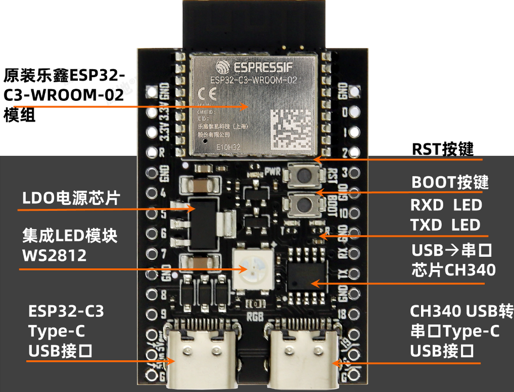
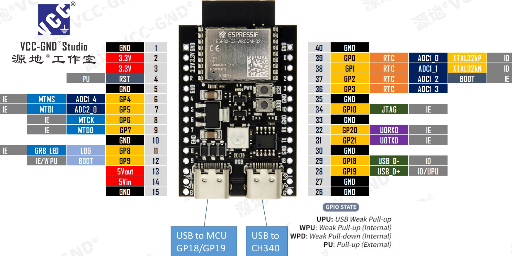

# IoT Gateway 项目

《物联网智能网关设计与开发》课程的教学项目（TP），基于 ESP32-C3 实现的多传感器智能网关设备。

- **当前版本**：0.2.0
- **ESP-IDF**：v6.0.1（已验证编译通过）
- **开发板**：ESP32-C3-DevKitM-1（兼容）
- **Flash**：4 MB（已用 ~1 MB / 应用分区剩余 34%）

版本变化请查看[更新日志](CHANGELOG.md)

---

## 开发板

- **兼容ESP32-C3-DevKitM-1的双Type-C接口开发板（当前版本使用）**
- **这里推荐源地工作室的双Type-C接口开发板，他们用的ESP32-C3模块是乐鑫原厂模块，成本较高，但稳定性最好。**


图中右侧的Type-C接口通过USB转串口芯片（如CH340）连接至ESP32-C3模块，其核心通信引脚为：
GPIO20（U0RXD）：接收数据引脚，连接CH340的TXD输出；
GPIO21（U0TXD）：发送数据引脚，连接CH340的RXD输入。
这两个引脚构成UART0串行通信通道，用于程序下载、串口调试和日志输出。该设计属于“经典款”开发板方案，依赖外部USB转串口芯片实现稳定通信，无需启用ESP32-C3的原生USB功能。
- **ESP32-S3-DevKitM-1（后续版本会添加）**

### 引脚分配

| 功能 | 引脚 |
|------|------|
|USB | GPIO18、GPIO19 左Type-C接口 |
|UART0 | RX:GPIO20、TX:GPIO21 右Type-C接口 |
|UART1 | RX:GPIO10、TX:GPIO5 接从MCU、功能模块|
| RGB LED (WS2812) | GPIO8 |
| Boot 按键 | GPIO9 |
| DHT11 温湿度 | GPIO4 物联网工程专业的学生不建议使用DHT11，软总线+精度差，后面会去掉支持DHT11 |
| MICS-5524 气体 | GPIO2 (ADC1_CHANNEL_0) |
| I2C SDA | GPIO6 |
| I2C SCL | GPIO7 |

---

## 整体架构

项目采用 **FreeRTOS 多任务 + 分层架构**，每个功能模块拆分为独立的任务，通过 **队列（Queue）/任务通知（TaskNotify）/事件组（EventGroup）/互斥锁（Mutex）** 等 FreeRTOS 原语进行解耦与同步。

```
╔══════════════════════════════════════════════════════════════════════════╗
║                    app_main.c  [系统入口 / 初始化]                       ║
║  ┌──────────┐  ┌──────────┐  ┌─────────────┐  ┌─────────────────────┐  ║
║  │ NVS Init │  │ esp_netif│  │  BSP Init   │  │  Start All Tasks    │  ║
║  │ (配置存储)│  │ event_loop│  │(I2C, LED)  │  │ monitor/wifi/sensor │  ║
║  └──────────┘  └──────────┘  └─────────────┘  │ mqtt/cmd/btn        │  ║
║                                                └─────────────────────┘  ║
╚══════════════════════════════════════════════════════════════════════════╝
                                      │
                                      ▼
┌──────────────────────────────────────────────────────────────────────────┐
│                        FreeRTOS 任务层（6 个独立任务）                    │
│                                                                          │
│  ┌─────────────────────┐     ┌─────────────────────┐                     │
│  │ task_wifi_manage    │     │ task_mqtt           │     数据流向：       │
│  │ [Priority=5, 8KB]   │     │ [Priority=4, 8KB]   │     ════════▶       │
│  │ ┌─────────────────┐ │     │ ┌─────────────────┐ │                     │
│  │ │ EventGroup:     │ │     │ │ 订阅 Topic:      │ │                     │
│  │ │   CONNECTED_BIT │─┼───▶ │ │   led/control   │ │                     │
│  │ │ (连接就绪标志)   │ │     │ └─────────────────┘ │                     │
│  │ │ 指数退避重连     │ │     │ ┌─────────────────┐ │                     │
│  │ └─────────────────┘ │     │ │ 发布 Topic:      │ │                     │
│  │                     │     │ │   sensor/data     │ │                     │
│  │ app_wifi_wait_for   │     │ │   status (LWT)    │ │                     │
│  │  ───────────────▶  │     │ └─────────────────┘ │                     │
│  └─────────────────────┘     └─────────────────────┘                     │
│            ▲                            ▲                                │
│            │ app_wifi_wait_for          │ app_mqtt_notify_new_data       │
│            │   connection(60s 超时)      │   (TaskNotify 异步唤醒)        │
│            ▼                            ▼                                │
│  ┌─────────────────────┐     ┌─────────────────────┐                     │
│  │ task_sensor         │     │ task_app_cmd        │                     │
│  │ [Priority=2, 8KB]   │     │ [Priority=3, 4KB]   │                     │
│  │ ┌─────────────────┐ │     │ ┌─────────────────┐ │                     │
│  │ │ DHT11 (GPIO4)  │ │     │ │ Command Queue   │ │                     │
│  │ │ MICS5524 (ADC) │─┼──┐  │ │ (LED_ON/OFF)    │ │                     │
│  │ │ ICM-20948 (I2C)│ │  │  │ └─────────────────┘ │                     │
│  │ │ AK09916 Mag    │ │  │  │                     │                     │
│  │ └─────────────────┘ │  │  └─────────────────────┘                     │
│  │                       │  │                     ▲                       │
│  │ sensor_data_mgr_update │  │                     │ app_send_command    │
│  │   ────────────────▶  │  │                     │  (xQueueSend)        │
│  │                       │  │                     │                       │
│  └─────────────────────┘  │  ┌─────────────────────┐                     │
│            │              │  │ task_button         │                     │
│            │              │  │ [Priority=2, 2KB]   │                     │
│            │              │  │ ┌─────────────────┐ │                     │
│            │              │  │ │ GPIO9 ISR → Queue│ │                     │
│            │              │  │ │ (去抖 50ms → LED)│ │                     │
│            │              │  │ └─────────────────┘ │                     │
│            │              │  └─────────────────────┘                     │
│            ▼              │                     ▲                       │
│  ┌─────────────────────┐  │                     │ bsp_led_toggle/on/off │
│  │ sensor_data_mgr     │  │                     │                       │
│  │ [共享数据层]         │  │  ┌──────────────────┴───────────┐           │
│  │ ┌─────────────────┐ │  │  │         BSP (板级支持包)       │           │
│  │ │ Mutex (xSemaphore)│  │  │ ┌────────────────────────────┐│           │
│  │ │ Temp/Humi/Gas    │ │  │  │ │ I2C Master Bus            ││           │
│  │ │ IMU Accel/Gyro  │ │  │  │ │  SDA=GPIO6, SCL=GPIO7      ││           │
│  │ │ Magnetometer     │ │  │  │ │  100kHz, 内部上拉          ││           │
│  │ │ 时间戳 + 陈旧阈值 │ │  │  │ └────────────────────────────┘│           │
│  │ │ 30s STALE_CHECK  │ │  │  │ ┌────────────────────────────┐│           │
│  │ └─────────────────┘ │  │  │ │ WS2812 RGB LED (RMT)       ││           │
│  │ ┌─────────────────┐ │  │  │ │  GPIO8, RGB 色值设置        ││           │
│  │ │ sensor_data_mgr │ │  │  │ └────────────────────────────┘│           │
│  │ │   _get_json()   │─┼──┘  │                              │           │
│  │ └─────────────────┘ │     └──────────────────────────────┘           │
│  └─────────────────────┘                              ▲                 │
│            ▲                                         │ GPIO 读/写        │
│            │                                         │                   │
└────────────┼─────────────────────────────────────────┼───────────────────┘
             │                                         │
             │                                         ▼
┌──────────────────────────────────────────────────────────────────────────┐
│                      task_monitor  [系统健康监控]                          │
│              [Priority=1, 2KB]    每 30s 输出一次报告                      │
│  ┌────────────────────────────────────────────────────────────────────┐  │
│  │ Free Heap / Min Ever Free                                          │  │
│  │ WiFi:    stack_total=8192B min_free=xxxxB used_peak=xxxxB (xx%)    │  │
│  │ MQTT:    stack_total=8192B min_free=xxxxB used_peak=xxxxB (xx%)    │  │
│  │ Sensor:  stack_total=8192B min_free=xxxxB used_peak=xxxxB (xx%)    │  │
│  │ Cmd:     stack_total=4096B min_free=xxxxB used_peak=xxxxB (xx%)    │  │
│  │ Button:  stack_total=2048B min_free=xxxxB used_peak=xxxxB (xx%)    │  │
│  └────────────────────────────────────────────────────────────────────┘  │
└──────────────────────────────────────────────────────────────────────────┘
```

**核心数据流与同步机制：**

| 路径 | 源模块 | 目的模块 | 同步机制 | 说明 |
|------|--------|----------|----------|------|
| ① | task_wifi_manage | task_mqtt | **EventGroup** | MQTT 等待 `WIFI_CONNECTED_BIT`（60s 超时）后才连接 broker |
| ② | task_sensor | sensor_data_mgr | **Mutex** | 温度/湿度/气体/IMU 数据写入受 `xSemaphoreTake/Give` 保护 |
| ③ | sensor_data_mgr | task_mqtt | **TaskNotify** | 传感器数据就绪后，`app_mqtt_notify_new_data()` 唤醒 MQTT 任务 |
| ④ | task_mqtt | task_app_cmd | **Queue** | MQTT 收到云端 LED 控制消息，`app_send_command_nonblock()` 投递命令队列 |
| ⑤ | task_app_cmd → BSP | 函数调用 | 直接调用 `bsp_led_on()/bsp_led_off()` |
| ⑥ | task_button → BSP | 函数调用 | GPIO ISR → 队列去抖 → `bsp_led_toggle()` |
| ⑦ | 所有任务 | task_monitor | **TaskHandle 注册** | 每个任务创建时调用 `task_monitor_register()` 登记栈大小 |

**优先级设计（高 → 低）：** WiFi(5) > MQTT(4) > Cmd(3) > Sensor(2) / Button(2) > Monitor(1)

> **设计意图**：网络通信（WiFi/MQTT）优先级最高，确保数据上传不被阻塞；传感器采集与命令处理居中；健康监控最低，仅在系统空闲时运行。

---

## 任务模块详解

### 1. WiFi 管理任务 (`task_app_wifi_manage.c`)

- **功能**：管理 WiFi STA 连接状态机，支持断线自动重连
- **状态机**：`DISCONNECTED → CONNECTING → CONNECTED → ERROR`（实际使用简化版本：自动指数退避）
- **连接参数**：
  - SSID / 密码来自 `menuconfig`（`CONFIG_WIFI_SSID` / `CONFIG_WIFI_PASSWORD`）
  - 重连策略：指数退避（500ms → 1s → 2s → ... → 最大 30s）
- **同步原语**：
  - `EventGroupHandle_t s_wifi_event_group` → 位 `WIFI_CONNECTED_BIT` 标记连接就绪
  - `WIFI_FAIL_BIT` 标记连接失败（当前版本主要使用 CONNECTED_BIT）
- **对外 API**：
  - `app_wifi_is_connected()` → 立即返回连接状态
  - `app_wifi_wait_for_connection(timeout_ticks)` → 阻塞等待，MQTT 任务通过此 API 延迟启动
- **优先级**：5（所有任务中最高），确保网络切换时及时重连

### 2. MQTT 客户端任务 (`task_app_mqtt.c`)

- **功能**：连接公共 MQTT Broker，上报传感器数据，订阅 LED 控制命令
- **Broker**：`mqtt://broker.emqx.io:1883`
- **Topic**：
  - `qzm999/iotgw/sensor/data` → 传感器数据发布（QoS 1，JSON 格式）
  - `qzm999/iotgw/led/control` → LED 控制订阅（QoS 1，消息体 `1`=开，`0`=关）
  - `qzm999/iotgw/status` → 设备在线状态，LWT 遗嘱 `{"status":"offline"}`
- **特性**：
  - MQTT v5 协议，Keepalive 30s，2s 自动重连
  - Client ID 基于 MAC 地址生成（格式：`qzm_iotgw_XXXXXXXXXXXX`）
  - 缓存上次 JSON，重连后自动补发（确保数据不丢失）
  - `app_mqtt_notify_new_data()`：通过 `xTaskNotify` 异步唤醒发布循环（无轮询）
  - `app_mqtt_publish_data(json, len)`：发布传感器数据，返回成功/失败
  - 订阅消息解析后投递到命令队列（`app_send_command_nonblock`），非阻塞，队列满时丢弃

### 3. 传感器统一任务 (`task_app_sensor.c`)

- **功能**：统一管理所有传感器数据采集，2 秒周期轮询
- **支持的传感器**：
  - **DHT11**：温湿度（GPIO4，单线协议，使用 `esp-idf-lib/dht` 组件库，内部 3 次重试）
  - **MICS-5524**：气体传感器（ADC1_CHANNEL_0，单次采样，`adc_oneshot` 新 API）
  - **ICM-20948**：9 轴 IMU（I2C 地址 0x68，加速度计 ±2g / 陀螺仪 ±250°/s，使用 `cybergear-robotics/icm20948` 组件库）
  - **AK09916**：磁力计（通过 ICM-20948 的 I2C BYPASS 模式访问，地址 0x0C，自动恢复机制）
- **采集流程**：
  1. DHT11 读取 → 更新温度/湿度（失败时保留上次数据，不阻塞后续）
  2. MICS-5524 ADC 读取 → 更新气体值
  3. ICM-20948 读取（Acc/Gyro/Temp，3 次重试保护 WiFi 中断干扰）
  4. AK09916 磁力计读取（BYPASS 模式，8 字节突发读取）
  5. 通过 `sensor_data_mgr_update_*()` 更新共享数据（受 Mutex 保护）
  6. `app_mqtt_notify_new_data()` → 唤醒 MQTT 任务发布
- **特性**：
  - 每个传感器独立失败重试机制
  - I2C BYPASS 模式：ICM 充当 I2C 中继，直接访问 AK09916
  - 磁力计自动恢复：若 DRDY 超时自动重新启用 BYPASS 再试
  - 30 秒陈旧数据阈值：`sensor_data_mgr_get_json()` 过滤过期字段
  - 任务看门狗（Task WDT）保护：每个传感器读取后重置 WDT
  - `esp_log` 输出采集周期摘要与每个传感器状态

### 4. 按键任务 (`task_app_btn.c`)

- **功能**：处理 Boot 按键（GPIO9）输入事件，中断驱动，零轮询
- **硬件配置**：GPIO9，内部上拉，上升沿触发中断
- **处理流程**：
  1. GPIO ISR（`IRAM_ATTR`，不可做复杂操作）→ `xQueueSendFromISR` 投递事件到队列
  2. 任务层 `xQueueReceive` 阻塞等待（`portMAX_DELAY`，零 CPU 占用）
  3. `vTaskDelay(50ms)` 软件消抖
  4. 二次读取 GPIO 电平确认按键按下
  5. `bsp_led_toggle(BSP_LED_COLOR_GOLD)` 切换金色 LED
- **特性**：
  - Queue 容量 5，可缓冲突发按键事件
  - ISR 中仅做队列投递，避免中断上下文耗时操作
  - `portYIELD_FROM_ISR`：ISR 退出后立即调度高优先级任务

### 5. 命令处理任务 (`task_app_cmd.c`)

- **功能**：统一处理来自 MQTT 的下行命令，基于显式状态机解析与执行
- **状态机**：`WAIT_CMD`（阻塞等待队列） → `LED_ON` / `LED_OFF`（调用 BSP）
- **命令队列**：
  - 类型：`QueueHandle_t`（FreeRTOS 队列）
  - 容量：10 条命令
  - 消息结构：`{ cmd[32], data[64] }`（命令字符串 + 可选数据）
- **API**：
  - `app_send_command(cmd, data)`：阻塞写入，超时 100ms，适合同步场景
  - `app_send_command_nonblock(cmd, data)`：零阻塞，队列满时直接返回 false（MQTT → 命令通道使用）
- **支持命令**：`LED_ON`、`LED_OFF`（cmd_id_from_str 字符串匹配映射）
- **设计意图**：将命令解析与执行集中在独立任务中，MQTT/HTTP/BLE 等上游通道只需投递字符串，关注点分离

### 6. 任务监控 (`task_monitor.c`)

- **功能**：周期性监控各任务栈使用率与系统堆内存健康状况
- **报告周期**：每 30 秒输出一次
- **注册机制**：`task_monitor_register(name, handle, stack_total)` → 任务创建后立即调用
- **报告内容**：
  - `Free Heap` / `Min Ever Free`（`heap_caps_get_free_size(MALLOC_CAP_8BIT)`）
  - 每个任务：`stack_total`、`min_free`、`used_peak`、`usage%`
  - 关键转换：`uxTaskGetStackHighWaterMark` 返回 **Word**（ESP32-C3 = 4 Byte），监控任务内部做 Byte 换算
- **支持监控的任务**：WiFi、MQTT、Sensor、Cmd、Button（共 5 个，最多 16 个）

---

## BSP 层 (`bsp.c`)

- **功能**：板级支持包，抽象硬件初始化与操作，提供稳定 API 给上层任务
- **I2C Master 总线**：
  - SDA=GPIO6，SCL=GPIO7，100kHz 标准模式
  - `i2c_new_master_bus()` 创建总线（ESP-IDF v6.0.1 新 API）
  - 内部上拉启用（`flags.enable_internal_pullup = true`）
  - 公共 API：`bsp_i2c_get_bus()` → 返回 `i2c_master_bus_handle_t`，供传感器任务挂载 ICM/AK09916 等设备
- **RGB LED (WS2812)**：
  - 引脚：GPIO8（`CONFIG_BLINK_GPIO`）
  - 后端：RMT（`led_strip_new_rmt_device`，分辨率 10MHz）
  - 颜色 API：`bsp_led_on_red/gold/green/blue`、`bsp_led_toggle(r, g, b)`、`bsp_led_set_color(r, g, b)`
  - 默认颜色：金色（`BSP_LED_COLOR_GOLD`）用于按键反馈，蓝色（`BSP_LED_COLOR_BLUE`）用于 MQTT 命令

---

## 共享数据层 (`sensor_data_mgr.c`)

- **功能**：线程安全的传感器数据中心，统一存储、读取与 JSON 序列化
- **数据结构**（`sensor_data_t`，受 `xSemaphoreHandle` Mutex 保护）：
  - 温度（°C）、湿度（%RH）、气体 ADC 值
  - IMU：加速度计 X/Y/Z（m/s²）、陀螺仪 X/Y/Z（°/s）、磁力计 X/Y/Z（μT）、芯片温度（°C）
  - 每个字段独立有效标志位（`valid`）与毫秒级时间戳（`timestamp_ms`）
- **核心 API**：
  - `sensor_data_mgr_init()` → 创建 Mutex，零初始化数据
  - `sensor_data_mgr_update_temperature/humidity/gas/imu/mag_only(...)` → 带锁写入
  - `sensor_data_mgr_get_json(buf, len)` → 生成紧凑 JSON 字符串
- **陈旧数据过滤**（30 秒阈值）：
  - `sensor_data_mgr_get_json()` 检查 `(now_ms - timestamp_ms) < 30000`
  - 过期字段不输出到 JSON，避免向云端上报垃圾数据
  - 磁力计字段独立 `mag_valid` 标志（即使 Acc/Gyro 失败，Mag 仍可独立更新）

---

## 架构设计要点

### 1. 任务解耦
- 每个功能模块独立任务，职责单一
- 任务间通过 FreeRTOS Queue / TaskNotify / EventGroup 通信
- 避免全局变量直接访问，统一通过模块 API

### 2. 分层设计
- **BSP 层**：硬件抽象（LED、I2C）
- **数据管理层**：传感器数据集中管理
- **业务逻辑层**：状态机、命令处理
- **通信层**：WiFi、MQTT

### 3. 组件优先使用 ESP Component Registry 中的成熟组件：
- `esp-idf-lib/dht` → DHT11 驱动
- `cybergear-robotics/icm20948` → ICM-20948 驱动
- `espressif/led_strip` → RGB LED 驱动
避免重复造轮子

### 4. 鲁棒性设计
- 任务看门狗（Task WDT）
- WiFi 指数退避重连
- MQTT 断线自动重连 + 数据缓存补发
- 传感器读取失败重试
- 磁力计 BYPASS 模式自动恢复
- 数据过期自动标记

---

## 功能清单

- ✅ DHT11 温湿度采集（5s 周期）
- ✅ MICS-5524 气体采集（5s 周期）
- ✅ ICM-20948 9轴 IMU 采集（5s 周期）
- ✅ 传感器数据 JSON 格式化
- ✅ RGB LED 控制（远程 + 本地按键）
- ✅ WiFi 自动连接 + 断线重连
- ✅ MQTT 数据上报（JSON）
- ✅ MQTT 远程 LED 控制
- ✅ 命令状态机
- ✅ 任务栈 / 堆内存监控
- ✅ 任务看门狗保护

---

## 项目结构

```
IotGateway_prj/
├── main/                           # 主应用代码
│   ├── app_main.c                 # 系统入口，分层启动
│   ├── task_app_wifi_manage.c     # WiFi 管理任务
│   ├── task_app_mqtt.c            # MQTT 客户端任务
│   ├── task_app_sensor.c          # 传感器统一采集任务
│   ├── task_app_btn.c             # 按键中断任务
│   ├── task_app_cmd.c             # 命令处理状态机
│   ├── task_monitor.c             # 任务栈/堆监控
│   ├── sensor_data_mgr.c          # 传感器数据管理中心
│   ├── bsp.c                      # 板级支持包（LED + I2C）
│   ├── idf_component.yml          # 组件依赖声明（MQTT/LED_STRIP/ICM20948）
│   └── CMakeLists.txt             # PRIV_REQUIRES 显式声明组件依赖
├── managed_components/             # ESP Component Registry 下载的组件
│   ├── esp-idf-lib__dht/          # DHT11 驱动
│   ├── cybergear-robotics__icm20948/  # ICM-20948 9轴 IMU 驱动
│   ├── espressif__led_strip/       # RGB LED 驱动（WS2812）
│   └── espressif__mqtt/             # MQTT 客户端（v6.0.1 中为托管组件）
├── Doc/                            # 项目文档目录
│   ├── images/                     # 图片资源（开发板照片、安装截图等）
│   ├── 操作.Prj从idf-v5.5.3移值到idf-v6.0.1.md   # ESP-IDF 版本迁移指南
│   ├── 操作1 把本地项目推送到一个新建的仓库.md   # Git 推送指南
│   ├── V0.0 260609分析架构-DeepSeekV4Pro.md     # 架构分析（AI 辅助）
│   ├── V0.0 260609分析架构-Doubuo-Seed-2-Code.md
│   ├── V0.0 260609分析架构-Qwen3.6-Plus.md
│   ├── task_app_mainbusiness任务中的状态机V0.0说明.md
│   └── 人岗和AI岗会话-备份-260608 11.39.md
├── IDF_vX.X.X_Powershell.Ink/       # ESP-IDF 各版本的 PowerShell 快捷方式
│   ├── ESP-IDF安装管理器安装好每个版本会生成一个对应的快捷方式.md
│   ├── IDF_v5.5.3_Powershell.lnk    # v5.5.3 开发环境快捷方式
│   ├── IDF_v5.5.4_Powershell.lnk    # v5.5.4 开发环境快捷方式
│   └── IDF_v6.0.1_Powershell.lnk    # v6.0.1 开发环境快捷方式（当前项目使用）
├── activate_idf.ps1                 # 在 Trae IDE 终端中一键激活 ESP-IDF 环境的脚本
├── Agent聊天记录_260613-2255_项目无BUG后清空对话前的备份.md
├── Agent聊天记录_260614-1320_项目无BUG后清空对话前的备份.md
├── README.md                        # 项目说明（本文件）
├── CHANGELOG.md                     # 更新日志
└── CMakeLists.txt                   # 顶层构建配置（MINIMAL_BUILD ON）
```

---

## ESP-IDF 开发环境说明

### 当前版本

- **ESP-IDF v6.0.1**（主要开发版本，已验证编译通过）
- 同时保留 v5.5.3 / v5.5.4 快捷方式，方便对比与切换
- 系统 Python：通过 ESP-IDF 安装管理器自动创建独立的 Python 虚拟环境（`idf6.0_py3.14_env`），不与系统 Python 冲突

### 在 Trae IDE 中激活 ESP-IDF

打开 Trae 的终端，在项目根目录执行以下任意一种方式：

**方式一（推荐）：使用 ESP-IDF 官方激活脚本**

```powershell
. "C:\Esp\v6.0.1\esp-idf\export.ps1"   # 注意开头的点和空格
idf.py --version                         # 验证：输出 "ESP-IDF v6.0.1"
idf.py build                             # 编译
idf.py flash monitor                     # 烧录并打开串口监控
```

**方式二：使用项目内脚本 `activate_idf.ps1`**

```powershell
. .\activate_idf.ps1 v6.0.1     # 激活 v6.0.1
. .\activate_idf.ps1 v5.5.3     # 切换到 v5.5.3
idf.py build
```

> **关键注意**：命令开头的 `. `（点 + 空格）是 PowerShell 的 dot-source 语法，它将 `idf.py` 函数注入到**当前 shell 会话**中。如果省略，脚本在子进程运行，终端内无法直接调用 `idf.py`。

### 使用 ESP-IDF 官方快捷方式

从 Windows 开始菜单或 `IDF_vX.X.X_Powershell.Ink/` 目录直接双击对应版本的 `.lnk` 快捷方式，打开已配置好环境变量的 PowerShell 窗口：

```powershell
cd D:\ws\prjsEducation\iotgateway\IotGateway_prj
idf.py build
```

---

## 编译、烧录与监控

### 一键操作

```powershell
# 1. 激活 ESP-IDF 环境
. "C:\Esp\v6.0.1\esp-idf\export.ps1"

# 2. 配置项目（首次编译前执行一次）
idf.py set-target esp32c3   # 设置目标芯片（已设置过则跳过）
idf.py menuconfig           # 图形化菜单配置（如 WiFi SSID/密码、UART 波特率等）

# 3. 编译
idf.py build                # 编译应用 + bootloader + 分区表

# 4. 烧录到开发板（需连接 USB 转串口）
idf.py -p COMx flash        # 烧录（COMx 为你的串口号，如 COM3）

# 5. 编译 + 烧录 + 串口监控（三合一）
idf.py -p COMx flash monitor

# 6. 仅查看内存/Flash 使用情况
idf.py size
```

### 编译产物与内存使用（基于 2026-06-16 构建）

| 项目 | 数值 |
|------|------|
| **应用固件 .bin 大小** | 1,020,178 字节（~996 KB） |
| **应用分区 factory 总大小** | 1,500 KB（0x177000） |
| **应用分区已用** | 66%（0xF9280） |
| **应用分区剩余** | **34%（~503 KB）** |
| **Flash Code (.text)** | 786,124 字节 |
| **Flash Data (.rodata 等)** | 145,224 字节 |
| **DRAM 使用** | 108,850 / 321,296 字节（**33.88%**） |
| **DRAM 剩余** | 212,446 字节 |
| **RTC Slow RAM** | 60 / 8,192 字节（0.73%） |

> **Flash 分区布局**（`partitions_singleapp_large.csv`）：
> - `0x0000` bootloader (28 KB) → `0x8000` 分区表 (4 KB) → `0x9000` NVS (24 KB) → `0xF000` PHY init (4 KB) → `0x10000` **factory 应用分区 (1,500 KB)**

### 常用命令速查

| 命令 | 说明 |
|------|------|
| `idf.py build` | 编译项目 |
| `idf.py clean` | 清理 build 目录（不清理依赖） |
| `idf.py fullclean` | 完全清理（需重新编译所有组件，较慢） |
| `idf.py -p COMx flash` | 烧录固件到开发板 |
| `idf.py -p COMx monitor` | 打开串口监控（Ctrl+] 退出） |
| `idf.py -p COMx flash monitor` | 编译+烧录+监控三合一 |
| `idf.py size` | 显示内存/Flash 使用统计 |
| `idf.py menuconfig` | 打开项目配置菜单 |
| `idf.py set-target esp32c3` | 设置目标芯片 |

---

## ESP-IDF v5.5.3 → v6.0.1 迁移要点

| 变更项 | v5.5.3 | v6.0.1 | 对本项目的影响 |
|---------|--------|--------|---------------|
| MQTT 组件 | ESP-IDF 核心组件 | 托管组件 (Registry) | 在 `main/idf_component.yml` 中声明 `espressif/mqtt: "^1.0"` |
| I2C 驱动 | `driver/i2c.h` (legacy) | `esp_driver_i2c` 独立组件 + `driver/i2c_master.h` (new API) | `main/CMakeLists.txt` 的 `PRIV_REQUIRES` 需显式声明 `esp_driver_i2c` |
| GPIO 驱动 | `driver/gpio.h`（在 `driver` 元组件中） | `esp_driver_gpio` 独立组件 | `PRIV_REQUIRES` 需声明 `esp_driver_gpio` |
| ADC 驱动 | `esp_adc` 组件 | `esp_adc` 组件（基本不变） | 保持 `PRIV_REQUIRES esp_adc` |
| 构建模式 | 默认包含全部组件 | `MINIMAL_BUILD ON`，只包含显式声明的组件 | `PRIV_REQUIRES` 必须完整声明所有用到的组件（`esp_netif`、`heap`、`esp_system` 等） |
| Python 环境 | `idf5.5_py3.13_env` | `idf6.0_py3.14_env` | 独立虚拟环境，互不冲突 |

### 关键文件变更对照

**`main/idf_component.yml`**（新增 MQTT 组件声明）

```yaml
dependencies:
  espressif/mqtt: "^1.0"            # ← v6.0.1 新增：MQTT 从核心组件变为托管组件
  espressif/led_strip: "~3.0"      # RGB LED 驱动
  esp-idf-lib/dht: "~1.2"           # DHT11 温湿度驱动
  cybergear-robotics/icm20948: "^0.1.0"  # ICM-20948 9轴 IMU 驱动
```

**`main/CMakeLists.txt`**（显式声明组件依赖）

```cmake
idf_component_register(SRCS "app_main.c" "task_monitor.c" "task_app_cmd.c"
                            "task_app_sensor.c" "task_app_wifi_manage.c"
                            "task_app_mqtt.c" "task_app_btn.c"
                            "sensor_data_mgr.c" "bsp.c"
                    INCLUDE_DIRS "."
                    PRIV_REQUIRES esp_adc           # ← ADC 单次采样
                                esp_driver_i2c     # ← v6.0.1 新增：I2C Master 驱动
                                esp_driver_gpio    # ← v6.0.1 新增：GPIO 驱动
                                esp_wifi           # WiFi 协议栈
                                esp_event          # 事件循环
                                nvs_flash          # 非易失性存储
                                mqtt               # ← v6.0.1 托管组件
                                esp_netif          # 网络接口层
                                heap               # 堆管理
                                esp_system)        # 系统服务
```

**`CMakeLists.txt`**（启用最小构建）

```cmake
cmake_minimum_required(VERSION 3.16)
include($ENV{IDF_PATH}/tools/cmake/project.cmake)
idf_build_set_property(MINIMAL_BUILD ON)   # ← v6.0.1 新增：只编译显式声明的组件
project(IotGateway_prj)
```

**`sdkconfig`**（关键配置项）

```
CONFIG_ESP32C3_XTAL_FREQ_40=y       # 晶振频率 40MHz
CONFIG_ESPTOOLPY_FLASHSIZE_4MB=y    # Flash 大小 4MB
CONFIG_ESPTOOLPY_FLASHMODE_DIO=y     # Flash 模式 DIO
CONFIG_ESPTOOLPY_FLASHFREQ_80M=y     # Flash 频率 80MHz
CONFIG_PARTITION_TABLE_SINGLE_APP_LARGE=y  # 分区表：大应用（1,500 KB factory）
CONFIG_ESP_CONSOLE_UART_DEFAULT=y    # 默认 UART0 串口控制台
CONFIG_FREERTOS_HZ=1000              # FreeRTOS 系统滴答 1 kHz
CONFIG_MAIN_TASK_STACK_SIZE=3584     # 主任务栈 3.5 KB
```

详细迁移步骤请参考 [操作.Prj从idf-v5.5.3移值到idf-v6.0.1.md](Doc/操作.Prj从idf-v5.5.3移值到idf-v6.0.1.md)。
